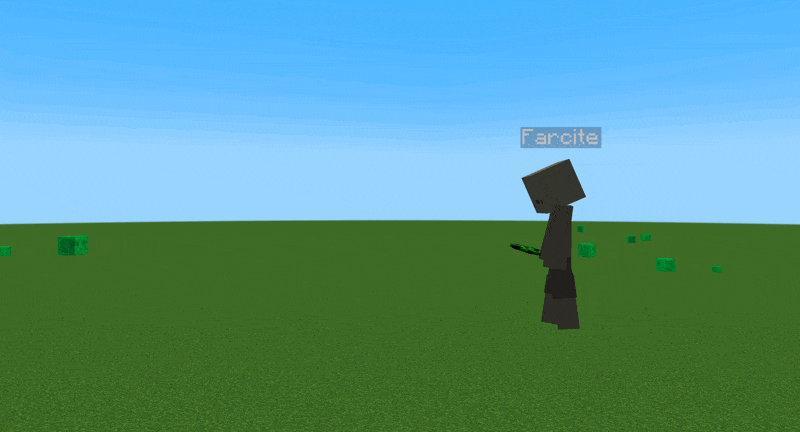

# Throwable Spawn Eggs

[](https://github.com/remonilo/throwable-spawn-egg/blob/main/LICENSE)
[](https://github.com/remonilo/throwable-spawn-egg/releases/latest)
[](https://www.minecraft.net/)
[](https://fabricmc.net/)


A Fabric mod that lets you throw spawn eggs instead of only using them on blocks. Works with vanilla spawn eggs and modded ones too.

<br clear="right">

## Features

<table>
  <tr>
    <td width="55%" valign="top">
      <ul>
        <li><strong>Throwable Spawn Eggs:</strong> Throw any spawn egg to spawn its entity upon impact (with a short 0.75s delay).</li>
        <li><strong>Modded Support:</strong> Works seamlessly out of the box with modded spawn eggs, not just vanilla ones.</li>
        <li><strong>Knockback Dynamics:</strong> Knocks back entities on direct hits identical to regular vanilla thrown eggs (deals zero damage).</li>
      </ul>
    </td>
    <td width="45%" align="center" valign="top">
      
    </td>
  </tr>
</table>

## Requirements

- Minecraft 1.21.1
- Fabric Loader
- Fabric API

## Installation

1. Install Fabric Loader for 1.21.1.
2. Download Fabric API and place the jar in your `mods` folder.
3. Download the latest release of this mod and place the jar in your `mods` folder.

## Building from source

```bash
git clone [https://github.com/remonilo/throwable-spawn-egg.git](https://github.com/remonilo/throwable-spawn-egg.git)
cd throwable-spawn-egg
./gradlew build
